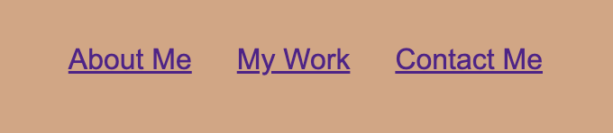

# Module 2 Challenge: Build a Professional Portfolio Webpage

## Description

This website has been built to showcase previous examples of coding work. 

It has been built to give prospective employers and partners a better understanding of previous work as opposed to a resume. 

## Table of Contents

- [Installation](#installation)
- [Usage](#usage)
- [Credits](#credits)
- [License](#license)

## Installation

There are installation steps required. This project can be opened on any web brower. 

Right-click the index.HTML file and select open in the browser of your choice

## Usage

Navigate the website as you would any conventional website. 

Clicking on any project card will take you to an external website. 

To navigate to a particular section of the webpage, use the nav bar in the top right corner (as seen in screenshot below)

## Credits

Thank you to the University of Sydney coding course. Much of the website was built by referring back to class work from that course. 

## License

MIT License. 

For full license details, refer to the license document in the Repository. 
